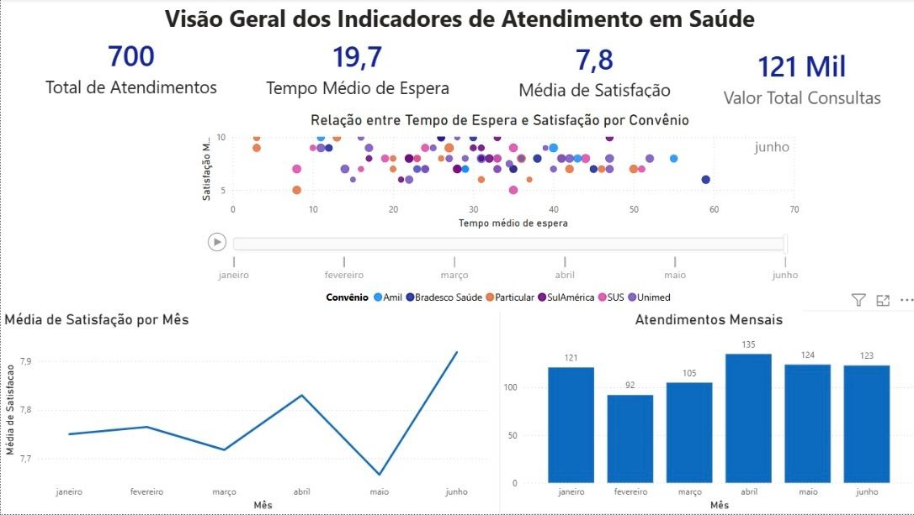
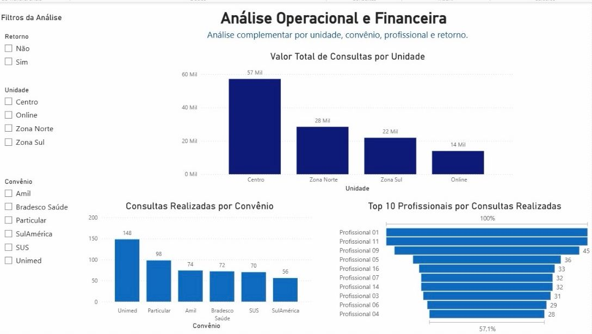

# Dashboard de Atendimentos em Saúde — Power BI

Dashboard desenvolvido em Power BI para análise de indicadores de atendimento em uma rede de saúde fictícia, com foco operacional e financeiro.

## Contexto
O projeto simula a análise de atendimentos de uma clínica com múltiplas unidades, permitindo acompanhar volume de consultas, tempo de espera, satisfação dos pacientes e desempenho por convênio e profissional.

*Observação: dados fictícios, utilizados para fins de estudo e portfólio.*

## Indicadores principais (KPIs)
- Total de atendimentos
- Tempo médio de espera
- Média de satisfação
- Valor total de consultas

## Análises disponíveis
- Evolução mensal de atendimentos e satisfação
- Relação entre tempo de espera e satisfação, por convênio
- Valor total de consultas por unidade
- Consultas realizadas por convênio
- Ranking dos profissionais por volume de atendimentos

## Filtros interativos
- Unidade (Centro, Online, Zona Norte, Zona Sul)
- Convênio (Amil, Bradesco Saúde, Particular, SulAmérica, SUS, Unimed)
- Retorno (Sim/Não)

## Ferramentas utilizadas
Power BI (modelagem de dados, DAX, visualização)

## Estrutura do repositório
dashboard-saude-powerbi/
├── dashboard-atendimento-saude.pbix
├── imagem/
└── README.md

## Prints do dashboard

